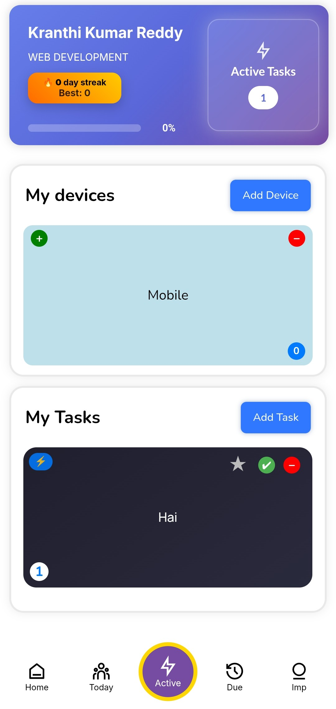
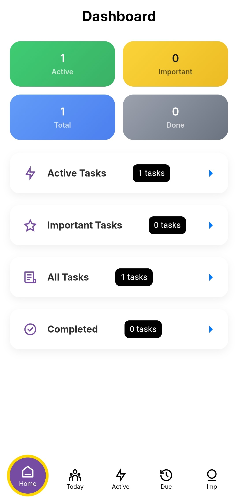
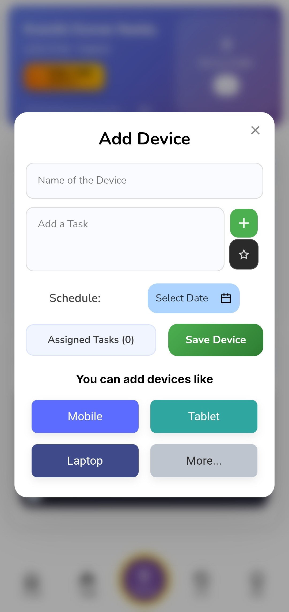
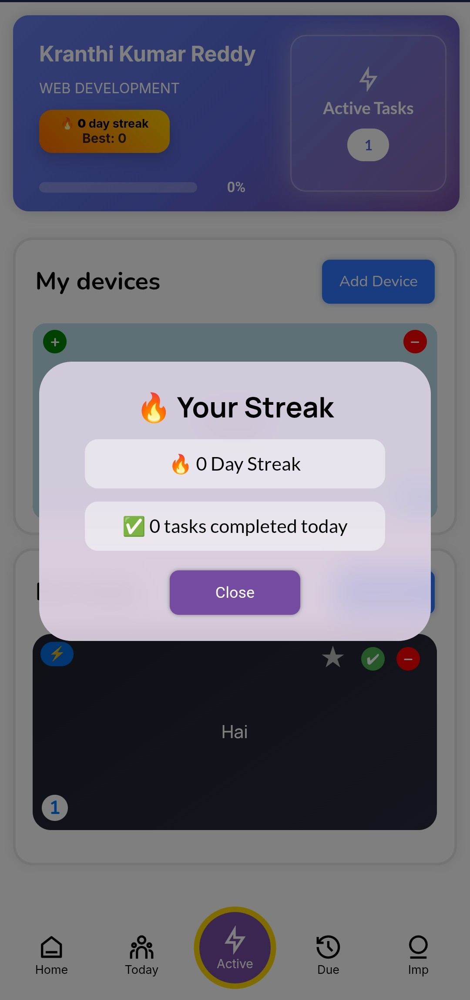
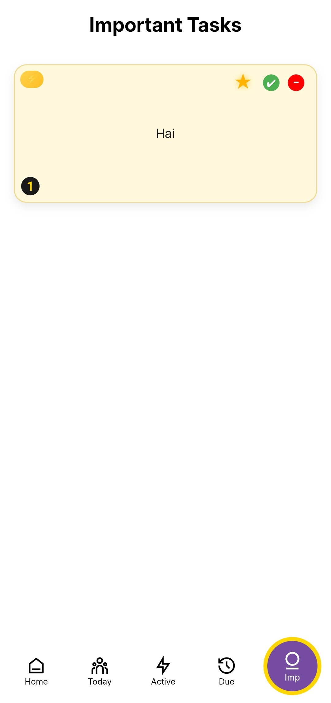

📋 MyTask App

📌 Overview

MyTask is a mobile application designed to help users organize and manage their daily tasks efficiently. The app provides a clean and user-friendly interface for creating, tracking, and managing tasks to improve productivity.

🚀 Features

- Add, update, and delete tasks
- Organize daily activities efficiently
- Simple and intuitive user interface
- Lightweight and easy to use
- Focus on productivity and task tracking

🛠️ Tech Stack

- Java / Kotlin (update based on what you used)
- Android Studio
- HTML
- JavaScript
- CSS

📸 Screenshots

- Active Page / Home
  

- Dashboard
  

- Add Device
  

- Streak
  

- Important
  

  
📦 APK Download

https://github.com/kranthi-07/MyTask/blob/main/app/release/app-release.apk

💻 GitHub Repository

https://github.com/kranthi-07/MyTask

📂 Project Structure

- "app/" – Main application code
- "gradle/" – Build configuration

🎯 Future Improvements

- Add task reminders and notifications
- Cloud sync for tasks
- Improved UI/UX design

👨‍💻 Author

Kranthi Kumar

- LinkedIn: https://www.linkedin.com/in/kranthi-vennapusa-767200286
- GitHub: https://github.com/kranthi-07
